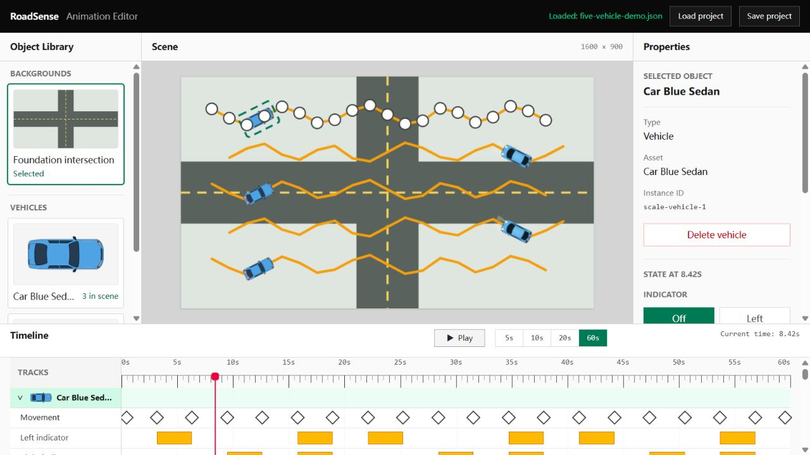

# RoadSense Animation Editor

RoadSense Animation Editor lets you create vehicle animations for road-rule learning scenarios in your browser. I built it to make it easier to arrange where vehicles go, when they move and how their lights change, instead of adjusting animation files by hand.

You can create a scene, edit the animation, preview it and save your work to reopen later.

**[Open the editor](https://roadsense-animation-editor.vercel.app/)** — use a desktop browser with a mouse and keyboard.



## Using the editor

Choose the intersection background and add a vehicle from the library. Select the vehicle, choose a time on the timeline and move it to where it should be at that moment. Repeat at other times to build its journey, then select a route and drag its handles to adjust the shape.

Use the timeline to arrange when the indicators, brake lights and headlights turn on and off. Click different times to check the scene, or press Play to watch the animation and Pause to inspect it.

Save project downloads your work as a file. Use Load project to reopen it and continue editing. To explore an existing animation, download [the example project](examples/five-vehicle-demo.json) and load it into the editor. It contains three Sedans and two Sports over 60 seconds.

## Implementation and design

The application uses React and strict TypeScript, with React Konva for scene drawing, Zustand for shared editor state, Tailwind CSS for the workspace and Vite for builds.

Several panels edit the same animation. I separated persistent project data from temporary editor state: movement, routes and state keyframes belong in the JSON project, while selection, playback and timeline layout do not. Shared mutation operations maintain the rules so scene, properties and timeline edits remain consistent.

Route drawing and preview use the same cubic Bézier geometry. The curve the user edits is also the curve used to calculate position and tangent direction at a given time. Time maps directly to curve progress, so the preview follows authored timing without a constant-speed simulation.

State intervals follow the same approach: the timeline derives them from keyframes and writes changes back to those boundaries. It does not maintain a second saved interval format. Each vehicle model declares its lamp geometry separately, allowing both models to use one visual binding.

Loading is another explicit boundary. The editor checks the file structure, animation rules and asset references before replacing the current project. Failed input explains the problem and preserves the user's existing work.

The [architecture](docs/ARCHITECTURE.md), [data contract](docs/DATA_CONTRACT.md) and [design decisions](docs/decisions/INDEX.md) describe these choices and their tradeoffs.

## Development process and AI assistance

I used AI assistance within a documented development workflow. Project scope, module responsibilities and data rules constrained the work. Each feature had requirements and acceptance criteria before implementation, followed by relevant tests, browser verification and human acceptance.

The engineering rules limited work to the current feature and required contract or architecture conflicts to be resolved explicitly. Design decisions and review results record how those rules were applied and refined during the MVP.

The [development records](docs/development/INDEX.md) follow the complete existing Phase 1–7 sequence, from the first workspace layout through final acceptance. They contain the requirements, numbered criteria, implementation and verification for each feature. The foundation plan, project rules and phase reports are included alongside them.

Start with the [process overview](docs/ENGINEERING_PROCESS.md), or follow the [delivery plan](docs/ROADMAP.md) and [feature breakdown](docs/FEATURES.md) through the records.

## Verification and delivery

The suite contains **504 tests across 72 files**, covering geometry, editing operations, state resolution, interface interactions, persistence and integrated workflows.

Phase checks verify how features work together. The scale gate checks five vehicles, 20 movement points per vehicle, 20 keyframes per state track and 60 seconds of animation. The final gate starts from an empty project and checks authoring, preview, save/load and recovery from invalid input.

GitHub Actions runs type checking, tests and a production build on Linux and Windows. The static application is hosted on Vercel. [Testing](docs/TESTING.md) provides the commands and public-release results; the [historical verification records](docs/testing/INDEX.md) retain the original phase evidence and browser limits.

## Run locally

Use Node.js 22.12 or newer on the Node 22 line and pnpm 11.25.0.

```sh
npm install --global pnpm@11.25.0
pnpm install --frozen-lockfile
pnpm dev
```

Open the URL printed by Vite. A desktop workspace of at least 1280 × 720 is recommended.

```sh
pnpm typecheck
pnpm test
pnpm build
pnpm exec vite preview
```

## Documentation

The [documentation index](docs/INDEX.md) connects the project brief, engineering rules, architecture, data contract, delivery plan, complete development records, decisions and verification reports.

The documents cover the accepted MVP. Earlier feature boundaries remain as part of its development history; plans beyond this version are excluded.

## MVP scope

This version includes one intersection background, two vehicle models, desktop editing and project files saved locally. Horn state is editable and saved without audio output. Accounts, cloud storage, undo/redo and mobile editing are outside the MVP.

## Copyright

Source code is publicly available for portfolio purposes. All rights reserved.

See [Copyright](COPYRIGHT.md). Third-party dependencies retain their own licenses.
