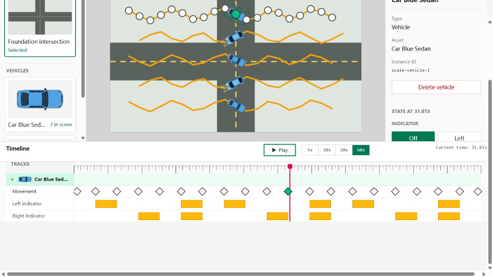

# Testing

## Local checks

After `pnpm install --frozen-lockfile`, run:

```sh
pnpm typecheck
pnpm test
pnpm build
```

For a focused workflow check:

```sh
pnpm exec vitest run tests/mvpAcceptance.test.ts tests/phase7Scale.test.ts
```

Vitest uses jsdom for interaction tests. Pure model, path, and persistence tests exercise deterministic data operations. Component tests use the editor's real operations rather than a parallel implementation.

## Coverage by behavior

| Area | Representative evidence |
|---|---|
| Path geometry | Bezier position and direction, control-point edits |
| Movement mutations | Insert, move, reorder, delete, duplicate-time rejection |
| State tracks | Initial values, interval creation/editing, indicator projection |
| Editor interactions | Selection sync, multiple vehicles, deletion confirmation |
| Preview | Seek, play, pause, state composition, empty/error availability |
| Persistence | Parsing, validation, asset resolution, canonical round trips |
| Scale | Five vehicles, 20 movement points per vehicle, state tracks, 60 seconds |
| MVP workflow | Create -> author -> preview -> serialize -> load -> recover |

## Verification evidence

The accepted MVP baseline contains 72 test files and 504 tests. On 2026-10-07, all passed in an isolated baseline snapshot; TypeScript strict checking and the production build also passed with Node.js 22.14.0. That run reused installed dependencies matching the unchanged baseline manifest and lockfile; it was not a fresh network installation.

The development server started successfully, and the page, entry module, background, and both vehicle SVGs returned HTTP 200.

The original MVP acceptance used a Chromium-based in-app browser for the complete authoring, preview, save/reload/load, and error-recovery workflow. Viewports of 1280 x 720, 1440 x 900, and 1920 x 1080 passed, with a scrolling fallback at 1024 x 600. Separate Chrome and Edge channels were unavailable for that acceptance run; those browsers are not claimed as independently verified in that run.

The prepared public directory was then installed from the frozen lockfile into a fresh dependency store on 2026-10-07. Installation, all 72 test files / 504 tests, TypeScript checks, and the production build passed. The release-review record outside the public directory records the checks.

A new Chromium in-app browser smoke check loaded `examples/five-vehicle-demo.json`, displayed three Sedans and two Sports, selected a vehicle across the timeline and properties panel, switched to the 60-second span, played preview, and paused at 8.42 seconds. The paused time remained unchanged on a later observation; captured browser logs contained no warnings or errors. This was a focused smoke check, not a repeat of the entire historical acceptance matrix.


GitHub Actions results will be available after the prepared repository is published and the workflow actually runs. No code-coverage percentage is claimed.

## Browser acceptance checklist

1. Start with an empty project; confirm usable guidance and unavailable playback.
2. Select the intersection and add both vehicle variants.
3. Author points at multiple times; verify selection across panels and duplicate-time rejection.
4. Edit Bezier control points and compare the previewed route with the visible path.
5. Create and edit indicator, brake-light, headlight, and horn intervals.
6. Seek, play, pause, resume, navigate the 5/10/20/60-second ranges, and check playback stops at 60 seconds.
7. Verify cancel/confirm deletion behavior and isolation between vehicles.
8. Save JSON, reload the page, load the saved file, and compare the restored animation.
9. Load invalid JSON and missing-asset input; confirm the current valid project survives.
10. Repeat the relevant interactions at desktop sizes and inspect the browser console.

## Known advisories

- The earlier audit using copied local dependencies emitted React `act(...)` environment warnings. The final run after a fresh locked installation completed without those warnings. Baseline test files remain unchanged.
- Vite reports the existing main JavaScript chunk of approximately 635.35 kB, exceeding its default size advisory. Build output remains successful.
- A jsdom suite and an HTTP smoke check do not replace full browser interaction testing.

## CI

`.github/workflows/ci.yml` runs on pull requests and pushes to `main` or `master`, and supports manual dispatch. Linux and Windows jobs install pnpm 11.25.0, use Node 22, install from the frozen lockfile, then run type checking, the complete test suite, and a production build. Workflow permissions are read-only; no deployment or publication is configured.

The setup follows the official [Node action guidance for pnpm lockfiles](https://github.com/actions/setup-node/blob/main/docs/advanced-usage.md) and [pnpm setup action](https://github.com/pnpm/action-setup).

## MVP scale screenshot



This original MVP acceptance capture shows the five-vehicle scale scene and timeline. It is a historical screenshot, not a new browser-automation result.
