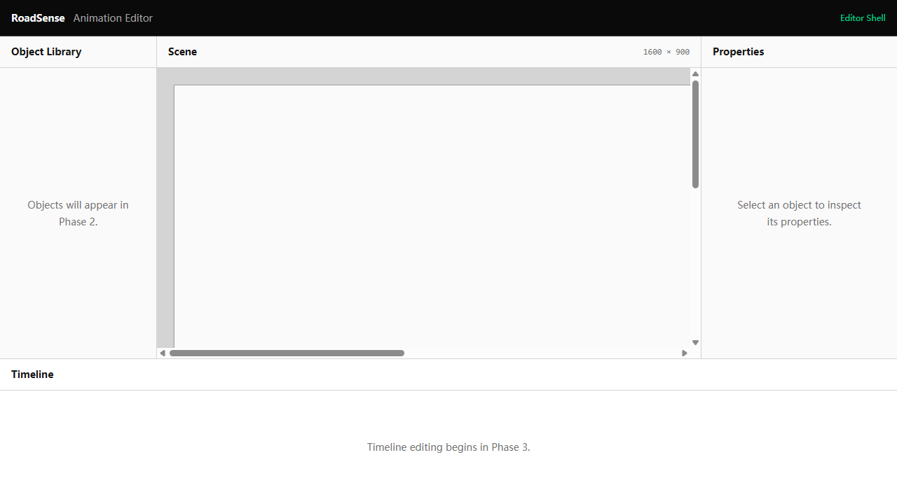

# F1.2 — Scene Viewport

**Status:** Completed; human browser acceptance passed.

## Requirement and scope

Replace the scene placeholder with a React Konva Stage and Layer, reading logical width and height directly from the current project. The default scene is 1600 × 900. This stage intentionally used 1:1 scale and a controlled two-axis scrolling container.

Automatic fitting belongs to F1.3 and panel refinement to F1.4. No backgrounds, objects or animation editing were included.

## Acceptance criteria

1. **AC1 — Surface:** The loaded scene panel contains a real Konva Stage.
2. **AC2 — Dimensions:** A 1600 × 900 project creates those logical dimensions and displays them in the heading.
3. **AC3 — Source:** Stage dimensions come from project.scene, without a second UI-owned dimension model.
4. **AC4 — Unscaled boundary:** Before scaling is implemented, oversized content remains at 1:1 and is accessible by scrolling.
5. **AC5 — State protection:** Viewing and scrolling leave project, current time and selection unchanged.
6. **AC6 — Feature boundary:** Only the neutral surface is rendered; no background, vehicle or editing controls.
7. **AC7 — Stability:** New and existing tests, strict type checking and build pass without new dependencies.

## Implementation and verification

SceneViewport renders Stage, Layer and a neutral rectangle. The panel displays project dimensions and supports horizontal/vertical scrolling. Layout and viewport tests verify the source, dimensions and boundary.

The original run passed 5 files / 12 tests, type checking and build; dependencies were unchanged. Vite reported its existing large-chunk advisory. At 1280 × 720 the scroll content was 1648 × 948: logical scene dimensions plus 24 px padding on each side.

The user accepted the logical dimensions, unscaled surface, scrolling and retained panel layout.

## Visual evidence

This acceptance image covers AC1, AC2, AC4, AC6 and layout regression. [Development preview](previews/f1.2/scene-viewport-current.png) is a separate progress capture.

**Original commit message:** `feat: add logical scene viewport`.

## Additional original visual evidence

- [Accepted capture: scene-viewport](./screenshots/f1.2/scene-viewport.png)
- [Progress preview: scene-viewport-current](./previews/f1.2/scene-viewport-current.png)
