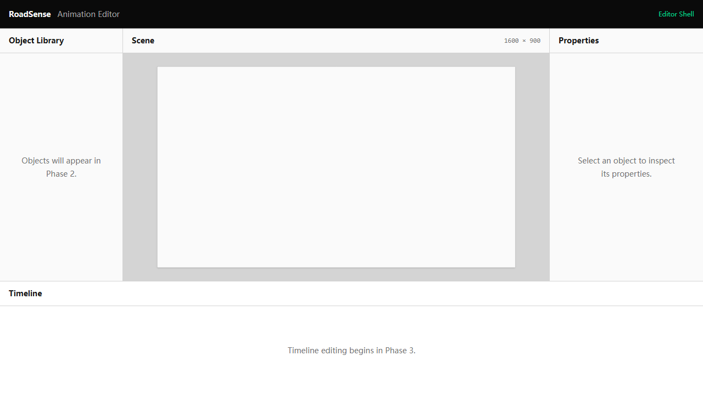
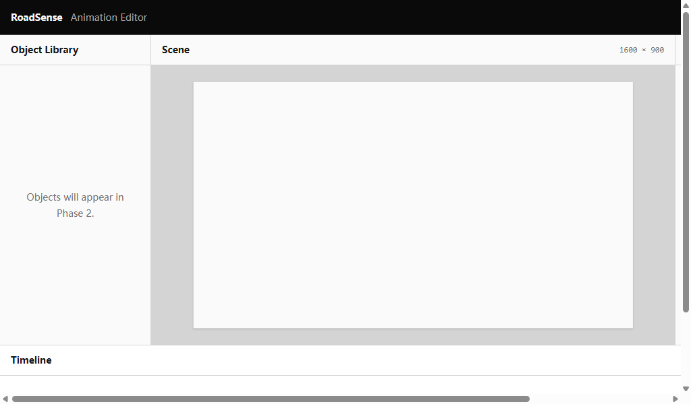

# F1.4 — Panel Layout Behaviour

**Status:** Completed; human browser acceptance passed.

## Requirement and layout contract

Fill the desktop viewport with usable, non-overlapping panels. Below the minimum size, preserve the workspace and allow page scrolling.

| Element | Feature-stage size |
|---|---|
| Minimum workspace | 1280 × 720 |
| Toolbar | 52 px high |
| Timeline | 208 px high |
| Library | 224 px wide |
| Properties | 280 px wide |
| Middle row / scene column | Remaining height / width |

Dimensions are centralized rather than repeated in components. This feature did not add panel resizing/collapse or editing capabilities. Smaller viewports provide a fallback rather than a mobile layout.

## Acceptance criteria

1. **AC1:** At 1280 × 720 all regions are visible, without overlap or page overflow.
2. **AC2:** Larger viewports remain filled; fixed panels keep sizes, scene gains space and timeline remains at the bottom.
3. **AC3:** Toolbar/timeline retain 52 / 208 px heights; the middle row uses remaining height.
4. **AC4:** Library/properties retain 224 / 280 px widths with scene between them.
5. **AC5:** Headings, dimensions and empty-state text stay inside their panels without shifting layout.
6. **AC6:** Below minimum, preserve 1280 × 720 and expose page scrolling rather than collapsed panels.
7. **AC7:** Scene remains centered and proportional with logical dimensions unchanged and no internal scene scrolling.
8. **AC8:** Resizing leaves project, time and selection unchanged.
9. **AC9:** No panel customization or later editing features appear.
10. **AC10:** Tests, strict type checking and build pass without dependency changes.

## Implementation and verification

EDITOR_LAYOUT supplies the shared dimensions to Editor. Layout tests check values, application and usable remaining scene width.

The original run passed 6 files / 24 tests, type checking and build. Dependencies and animation behavior were unchanged; the existing bundle advisory remained.

Measured scene widths were 776, 936 and 1416 px at 1280 × 720, 1440 × 900 and 1920 × 1080. Supported sizes had no page overflow. At 1024 × 600, the document remained 1280 × 720 with two-axis page scrolling. Scene ratio remained approximately 1.77778 without internal overflow. The user accepted the layouts and fallback.

## Visual evidence

These cover region placement/containment and fallback. Progress captures: [minimum](previews/f1.4/panel-layout-1280x720.png), [fallback](previews/f1.4/panel-layout-1024x600.png).

**Original commit message:** `feat: stabilize editor panel layout`.

## Additional original visual evidence

- [Accepted capture: panel-layout-1280x720](./screenshots/f1.4/panel-layout-1280x720.png)
- [Accepted capture: panel-layout-1024x600](./screenshots/f1.4/panel-layout-1024x600.png)
- [Progress preview: panel-layout-1280x720](./previews/f1.4/panel-layout-1280x720.png)
- [Progress preview: panel-layout-1024x600](./previews/f1.4/panel-layout-1024x600.png)
